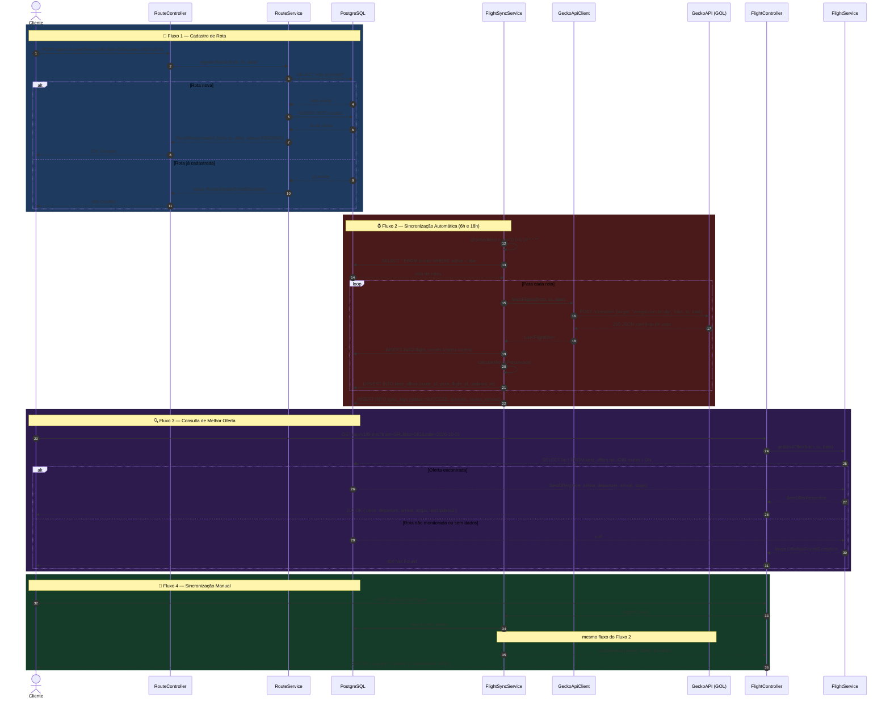

# Diagrama de Sequência — fly-free

```mermaid
sequenceDiagram
    autonumber

    actor Cliente
    participant RC as RouteController
    participant RS as RouteService
    participant DB as PostgreSQL
    participant SCHED as FlightSyncService
    participant GC as GeckoApiClient
    participant GECKO as GeckoAPI (GOL)
    participant FC as FlightController
    participant FS as FlightService

    rect rgb(30, 58, 95)
        Note over Cliente, DB: 📌 Fluxo 1 — Cadastro de Rota
        Cliente->>RC: POST /api/v1/routes?from=GRU&to=GIG&date=2026-10-01
        RC->>RS: registerRoute(from, to, date)
        RS->>DB: SELECT rota já existe?
        alt Rota nova
            DB-->>RS: não existe
            RS->>DB: INSERT INTO routes
            DB-->>RS: route salva
            RS-->>RC: RouteResponse(id, from, to, date, status=PENDING)
            RC-->>Cliente: 201 Created
        else Rota já cadastrada
            DB-->>RS: já existe
            RS-->>RC: lança RouteAlreadyExistsException
            RC-->>Cliente: 409 Conflict
        end
    end

    rect rgb(74, 26, 26)
        Note over SCHED, DB: ⏰ Fluxo 2 — Sincronização Automática (6h e 18h)
        SCHED->>SCHED: @Scheduled cron="0 0 6,18 * * *"
        SCHED->>DB: SELECT * FROM routes WHERE active = true
        DB-->>SCHED: lista de rotas

        loop Para cada rota
            SCHED->>GC: fetchFlights(from, to, date)
            GC->>GECKO: POST /v1/extract {target: "voegol.com.br:plp", from, to, date}
            GECKO-->>GC: 200 JSON com lista de voos
            GC-->>SCHED: List<FlightDto>
            SCHED->>DB: INSERT INTO flight_results (dados brutos)
            SCHED->>SCHED: calcularMenorPreco(voos)
            SCHED->>DB: UPSERT INTO best_offers (route_id, price, flight_id, updated_at)
        end

        SCHED->>DB: INSERT INTO sync_logs (status=SUCCESS, duration, routes_synced)
    end

    rect rgb(45, 27, 78)
        Note over Cliente, DB: 🔍 Fluxo 3 — Consulta de Melhor Oferta
        Cliente->>FC: GET /api/v1/flights?from=GRU&to=GIG&date=2026-10-01
        FC->>FS: getBestOffer(from, to, date)
        FS->>DB: SELECT bo.* FROM best_offers bo JOIN routes r ON ...
        alt Oferta encontrada
            DB-->>FS: BestOffer(price, airline, departure, arrival, stops)
            FS-->>FC: BestOfferResponse
            FC-->>Cliente: 200 OK { price, departure, arrival, stops, lastUpdated }
        else Rota não monitorada ou sem dados
            DB-->>FS: null
            FS-->>FC: lança OfferNotFoundException
            FC-->>Cliente: 404 Not Found
        end
    end

    rect rgb(20, 60, 40)
        Note over Cliente, DB: 🔧 Fluxo 4 — Sincronização Manual
        Cliente->>FC: POST /api/v1/sync/trigger
        FC->>SCHED: triggerSync()
        SCHED->>DB: busca rotas ativas
        Note over SCHED, GECKO: mesmo fluxo do Fluxo 2
        SCHED-->>FC: SyncResult(synced, failed, duration)
        FC-->>Cliente: 200 OK { synced: 5, failed: 0, durationMs: 3200 }
    end
```
