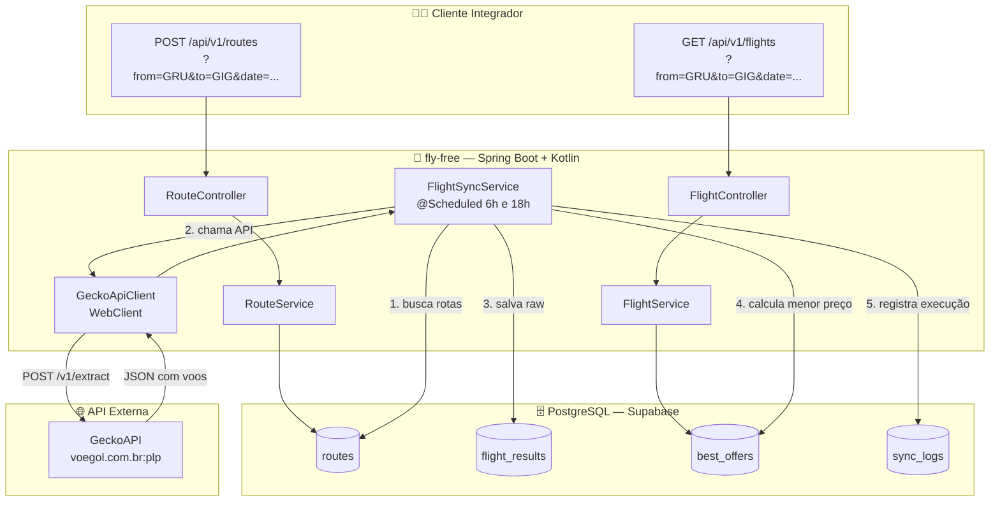

# Fluxograma — fly-free

```mermaid
flowchart TB
    subgraph CLIENT["🧑‍💻 Cliente Integrador"]
        C1["POST /api/v1/routes\n?from=GRU&to=GIG&date=..."]
        C2["GET /api/v1/flights\n?from=GRU&to=GIG&date=..."]
    end

    subgraph FLYFREE["🚀 fly-free — Spring Boot + Kotlin"]
        RC["RouteController"]
        FC["FlightController"]
        RS["RouteService"]
        FS["FlightService"]
        SYNC["FlightSyncService\n@Scheduled 6h e 18h"]
        GC["GeckoApiClient\nWebClient"]
    end

    subgraph DB["🗄️ PostgreSQL — Supabase"]
        T1[("routes")]
        T2[("flight_results")]
        T3[("best_offers")]
        T4[("sync_logs")]
    end

    subgraph EXTERNAL["🌐 API Externa"]
        GECKO["GeckoAPI\nvoegol.com.br:plp"]
    end

    %% Fluxo cadastro de rota
    C1 --> RC --> RS --> T1

    %% Fluxo consulta de voo
    C2 --> FC --> FS --> T3

    %% Fluxo do scheduler
    SYNC -->|"1. busca rotas"| T1
    SYNC -->|"2. chama API"| GC
    GC -->|"POST /v1/extract"| GECKO
    GECKO -->|"JSON com voos"| GC
    GC --> SYNC
    SYNC -->|"3. salva raw"| T2
    SYNC -->|"4. calcula menor preço"| T3
    SYNC -->|"5. registra execução"| T4
```
